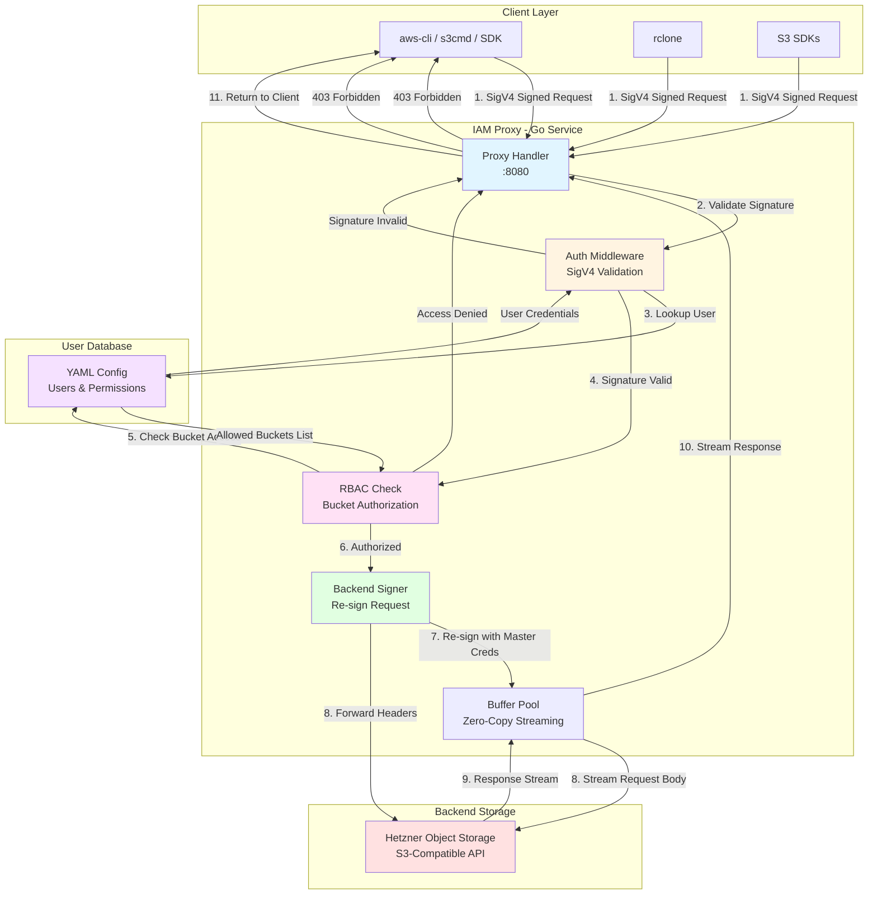

# Go S3 IAM Proxy for Hetzner Object Storage

A high-performance, production-ready S3-compatible IAM proxy written in Go that adds fine-grained access control to object storage backends that lack native IAM policies (like Hetzner Object Storage).

## Overview

The proxy sits in front of an S3-compatible backend and:

- Validates AWS SigV4 requests (header-based or presigned URLs).
- Enforces bucket-level RBAC from a YAML user database.
- Re-signs requests with backend master credentials.
- Streams request and response bodies without buffering by default.

## Features

- ✅ **AWS Signature V4 Authentication**: Full SigV4 validation for both header-based and presigned URLs
- ✅ **Optional Content Integrity Verification**: Configurable body hash validation (performance vs. security trade-off)
- ✅ **Zero-Copy Streaming**: Uses `UNSIGNED-PAYLOAD` and `io.Copy` for memory-efficient request proxying
- ✅ **RBAC (Role-Based Access Control)**: YAML-based user management with per-bucket permissions
- ✅ **High Concurrency**: Optimized `http.Transport` with high connection pooling
- ✅ **Structured Logging**: JSON logging via `uber-go/zap`
- ✅ **Graceful Shutdown**: Handles SIGTERM/SIGINT with connection draining
- ✅ **S3 Compatible**: Works with `aws-cli`, `rclone`, `s3cmd`, and all S3 SDKs

## Architecture



### Request Flow

1. **Client → Proxy**: Client sends SigV4-signed request with their credentials
2. **Authentication**: Proxy validates signature against YAML user database
3. **Authorization**: Checks if user has access to the requested bucket
4. **Re-signing**: Strips client auth, adds master credentials, re-signs with backend keys
5. **Streaming**: Proxies request/response with zero-copy streaming
6. **Response**: Returns backend response to client

## Performance Characteristics

- **Memory**: O(1) - No request body buffering (when `verify_content_integrity: false`)
- **Latency**: ~1-2ms overhead for signature validation (without integrity verification)
- **Throughput**: Tested at 1000+ concurrent connections
- **CPU**: Multi-core aware (`GOMAXPROCS=NumCPU`)

_Note: Performance characteristics change when `verify_content_integrity: true` is enabled. See Security section for details._

## Installation

### Prerequisites

- Go 1.25 or higher
- Access to Hetzner Object Storage (or any S3-compatible backend)

### Build from Source

```bash
# Clone repository
git clone https://github.com/pratikbin/go-s3-rbac-single-bucket.git
cd go-s3-rbac-single-bucket

# Download dependencies
go mod download

# Build binary
go build -o s3-proxy .

# Run
./s3-proxy -config config.yaml
```

## Configuration

### config.yaml

```yaml
# Master credentials for Hetzner Object Storage backend
master_credentials:
  access_key: "YOUR_HETZNER_ACCESS_KEY"
  secret_key: "YOUR_HETZNER_SECRET_KEY"
  endpoint: "https://fsn1.your-objectstorage.com"
  region: "us-east-1"

# Proxy server settings
server:
  listen_addr: ":8080"
  read_timeout: "300s"
  write_timeout: "300s"
  idle_timeout: "120s"
  max_header_bytes: 1048576

# Security settings
security:
  verify_content_integrity: false # See "Content Integrity Verification" section
  max_verify_body_size: 52428800

# User database with RBAC
users:
  - access_key: "user1-key"
    secret_key: "user1-secret"
    allowed_buckets:
      - "bucket-alpha"
      - "bucket-beta"

  - access_key: "admin-key"
    secret_key: "admin-secret"
    allowed_buckets:
      - "*" # Access all buckets

# Logging
logging:
  level: "info"
  format: "json"

# Metrics (Prometheus)
metrics:
  enabled: true
  address: ":9090"
  path: "/metrics"
```

## Usage

### Start the Proxy

```bash
./s3-proxy -config config.yaml
```

### Configure S3 Client

#### AWS CLI

```bash
# Configure credentials
aws configure set aws_access_key_id user1-key
aws configure set aws_secret_access_key user1-secret
aws configure set default.region us-east-1

# Point to proxy (use path-style addressing)
aws s3 ls s3://bucket-alpha \
  --endpoint-url http://localhost:8080

# Upload file
aws s3 cp file.txt s3://bucket-alpha/file.txt \
  --endpoint-url http://localhost:8080
```

#### rclone

```ini
[s3proxy]
type = s3
provider = Other
access_key_id = user1-key
secret_access_key = user1-secret
endpoint = http://localhost:8080
region = us-east-1
```

```bash
rclone ls s3proxy:bucket-alpha
```

#### Go SDK (aws-sdk-go-v2)

```go
import (
    "github.com/aws/aws-sdk-go-v2/aws"
    "github.com/aws/aws-sdk-go-v2/config"
    "github.com/aws/aws-sdk-go-v2/service/s3"
)

cfg, _ := config.LoadDefaultConfig(context.TODO(),
    config.WithRegion("us-east-1"),
    config.WithCredentialsProvider(
        credentials.NewStaticCredentialsProvider("user1-key", "user1-secret", ""),
    ),
)

client := s3.NewFromConfig(cfg, func(o *s3.Options) {
    o.BaseEndpoint = aws.String("http://localhost:8080")
    o.UsePathStyle = true
})
```

## Security Considerations

### Authentication

- **SigV4 Validation**: Full AWS Signature V4 implementation
- **Timestamp Verification**: Rejects requests with >15min clock skew (replay attack prevention)
- **Constant-Time Comparison**: HMAC signatures compared using `hmac.Equal()`

### Authorization

- **Bucket-Level ACL**: Users can only access explicitly allowed buckets
- **Wildcard Support**: Use `"*"` in `allowed_buckets` for admin users
- **Case-Insensitive**: Bucket names are compared case-insensitively

### Content Integrity Verification

The proxy provides **optional content integrity verification** with configurable security vs. performance trade-offs:

#### Default Mode: `verify_content_integrity: false` (Recommended for Performance)

- **Behavior**: Proxy uses `UNSIGNED-PAYLOAD` and streams data without buffering
- **Security**:
  - Client's SigV4 signature proves they have the secret key
  - TLS encrypts transport (client→proxy→backend)
  - Body hash is NOT verified against actual body content
- **Performance**:
  - Zero memory buffering
  - Constant O(1) memory usage
  - Minimal latency overhead (~1-2ms)
- **Use Case**: High-throughput scenarios, trusted networks, authorization-focused deployments

#### Strict Mode: `verify_content_integrity: true` (Security-Critical Deployments)

- **Behavior**: Proxy reads entire body, computes SHA256, verifies against `X-Amz-Content-Sha256` header
- **Security**:
  - Prevents tampering between signature generation and proxy
  - End-to-end integrity from client to backend
  - Rejects requests with hash mismatches (logged as security violations)
- **Performance Impact**:
  - Memory: O(n) - entire body buffered in RAM
  - Latency: Increased (depends on body size)
  - Throughput: Reduced for large objects
- **Use Case**: Compliance requirements, untrusted networks, security-critical data

#### Configuration Example

```yaml
security:
  verify_content_integrity: false # Default: performance
  # verify_content_integrity: true  # Enable for security-critical deployments
```

#### Exceptions (Always Skipped)

The following request types are **never** verified, even when `verify_content_integrity: true`:

1. **Streaming uploads**: `STREAMING-AWS4-HMAC-SHA256-PAYLOAD` (uses chunk-level auth)
2. **Unsigned payloads**: Client explicitly sends `UNSIGNED-PAYLOAD`
3. **Requests without body**: GET, HEAD, DELETE operations
4. **Missing hash header**: No `X-Amz-Content-Sha256` provided

#### Security Trade-Off Analysis

| Aspect                       | verify_content_integrity: false | verify_content_integrity: true |
| ---------------------------- | ------------------------------- | ------------------------------ |
| **Signature Verification**   | ✅ Always enforced              | ✅ Always enforced             |
| **Body Hash Verification**   | ❌ Not checked                  | ✅ Verified                    |
| **Replay Attack Prevention** | ✅ Timestamp check (±15min)     | ✅ Timestamp check (±15min)    |
| **Transport Security**       | ✅ TLS encrypted                | ✅ TLS encrypted               |
| **Memory Usage**             | O(1) constant                   | O(n) body size                 |
| **Latency**                  | Minimal (~1-2ms)                | Higher (depends on size)       |
| **Threat Model**             | Authorization proxy             | End-to-end integrity           |

#### Recommendations

- **Performance-focused** (default): Keep disabled, rely on TLS for transport security
- **Security-critical**: Enable verification, accept performance trade-off
- **Hybrid approach**: Run multiple proxy instances (one strict for sensitive buckets, one fast for bulk data)

### Multipart Upload Support

The proxy **fully supports S3 multipart uploads** with proper handling of large files:

#### How It Works

1. **Initiate Multipart Upload** (POST with `?uploads`):
   - Empty body, signed with `UNSIGNED-PAYLOAD`
   - Returns `uploadId` from backend

2. **Upload Parts** (PUT with `?partNumber=N&uploadId=XXX`):
   - Large binary data (up to 5GB per part)
   - Signed with `UNSIGNED-PAYLOAD` for streaming efficiency
   - Content-Length preserved (required by S3 spec)
   - Zero-copy streaming through 64KB buffer pool

3. **Complete Multipart Upload** (POST with `?uploadId=XXX`):
   - XML body contains part ETags
   - **Key behavior**: Signed with `UNSIGNED-PAYLOAD`
   - XML body is **still sent and parsed** by backend
   - Backend validates signature (ignores body hash) but processes XML

#### Why UNSIGNED-PAYLOAD Works for CompleteMultipartUpload

```
Client → Proxy:
  - Sends XML: <CompleteMultipartUpload><Part><ETag>...</ETag></Part>...
  - X-Amz-Content-Sha256: UNSIGNED-PAYLOAD
  - Signature covers: method, path, headers (not body hash)

Proxy → Backend:
  - Forwards XML unchanged
  - Re-signs with: UNSIGNED-PAYLOAD
  - Backend signature validation: ✅ (checks signature, not body hash)
  - Backend XML parsing: ✅ (processes <CompleteMultipartUpload>)
  - Backend verifies part ETags match uploaded parts: ✅
```

**Result**: ✅ Multipart uploads work correctly without buffering large XML manifests

#### Performance Characteristics

- **Memory**: O(1) - No buffering of parts or XML (streaming only)
- **Connection Pool**: 50 concurrent uploads per bucket
- **Timeouts**:
  - ExpectContinueTimeout: 5s (for 100-continue negotiation)
  - ResponseHeaderTimeout: 60s (for backend processing)
- **Max Part Size**: 5GB (S3 limit)
- **Max Parts**: 10,000 (S3 limit)

#### Tested Scenarios

✅ InitiateMultipartUpload (empty body)
✅ UploadPart with 5MB binary data
✅ CompleteMultipartUpload with XML manifest
✅ CompleteMultipartUpload with verified content hash (optional)
✅ Content-Length preservation for all operations

### Additional Security Best Practices

1. **Use TLS/HTTPS**: Always enable TLS for production deployments
2. **Network Isolation**: Run proxy in trusted network segment
3. **Rotate Credentials**: Periodically update master and user credentials
4. **Monitor Logs**: Alert on authentication failures and hash mismatches
5. **Least Privilege**: Grant users minimal bucket access needed

## Deployment

### Systemd Service

#### Installation

Use the provided installation script:

```bash
# Build the binary first
go build -o s3-proxy .

# Install systemd service (requires root)
sudo ./install-systemd.sh
```

#### Service Files

The installation creates:

1. **Service file**: `/etc/systemd/system/s3-proxy.service`
2. **Environment file**: `/etc/default/s3-proxy` (optional)
3. **Configuration directory**: `/etc/s3-proxy/`
4. **Log directory**: `/var/log/s3-proxy/`
5. **Service user**: `s3proxy`

#### Service Management

```bash
# Start service
sudo systemctl start s3-proxy

# Stop service
sudo systemctl stop s3-proxy

# Enable auto-start on boot
sudo systemctl enable s3-proxy

# Check status
sudo systemctl status s3-proxy

# View logs
sudo journalctl -u s3-proxy -f

# Reload configuration
sudo systemctl reload s3-proxy

# Restart service
sudo systemctl restart s3-proxy
```

#### Security Features

The systemd service includes security hardening:

- **NoNewPrivileges**: Prevents privilege escalation
- **PrivateTmp**: Isolated temporary directories
- **ProtectSystem**: Read-only system directories
- **MemoryDenyWriteExecute**: Prevents memory execution
- **Resource limits**: File descriptors, processes, memory
- **Restricted capabilities**: Minimal Linux capabilities

#### Configuration

Edit `/etc/s3-proxy/config.yaml` after installation:

```yaml
# See Configuration section for details
```

#### Logging

Logs are captured by systemd journal:

```bash
# View all logs
journalctl -u s3-proxy

# Follow logs in real-time
journalctl -u s3-proxy -f

# View logs since boot
journalctl -u s3-proxy -b

# View logs with JSON formatting
journalctl -u s3-proxy -o json
```

#### Metrics Integration

Metrics are available on port `:9090` by default:

```bash
# Check metrics endpoint
curl http://localhost:9090/metrics

# Configure Prometheus to scrape
# Add to prometheus.yml:
#   - job_name: 's3-proxy'
#     static_configs:
#       - targets: ['localhost:9090']
```

### Kubernetes

See `k8s/` directory for Deployment, Service, and ConfigMap manifests.

## Monitoring

### Health Check

```bash
curl http://localhost:8080/
```

### Metrics - falky

The proxy exposes Prometheus metrics on a separate endpoint for real-time monitoring and alerting.

#### Configuration

Enable metrics in `config.yaml`:

```yaml
metrics:
  enabled: true # Enable Prometheus metrics endpoint
  address: ":9090" # Metrics server address (default: :9090)
  path: "/metrics" # Metrics endpoint path (default: /metrics)
```

#### Available Metrics

The proxy exposes the following Prometheus metrics:

##### Request Metrics

- `s3_proxy_requests_total` - Total HTTP requests processed (labels: `method`, `code`, `bucket`, `user`)
- `s3_proxy_request_duration_seconds` - Request duration histogram (labels: `method`, `bucket`)
- `s3_proxy_in_flight_requests` - Current number of in-flight requests

##### Data Transfer Metrics

- `s3_proxy_data_transfer_bytes_total` - Total bytes transferred (labels: `direction`, `user`, `bucket`)
  - `direction`: `in` (upload) or `out` (download)

##### Backend Performance Metrics

- `s3_proxy_backend_latency_seconds` - Backend (Hetzner) latency histogram (labels: `method`, `bucket`)

##### Security Metrics

- `s3_proxy_auth_errors_total` - Authentication errors (labels: `reason`)
  - `reason`: `signature_mismatch`, `clock_skew`, `missing_credentials`, etc.
- `s3_proxy_rbac_denied_total` - RBAC denials (labels: `user`, `bucket`)

##### System Metrics

- `s3_proxy_buffer_pool_requests_total` - Buffer pool operations (labels: `action`)
  - `action`: `get` (buffer allocation) or `put` (buffer release)
- Go runtime metrics (via `collectors.NewGoCollector()`):
  - `go_goroutines` - Number of goroutines
  - `go_memstats_alloc_bytes` - Memory allocated
  - `go_gc_duration_seconds` - GC duration

#### Metrics Collection

##### Prometheus Configuration

Add to `prometheus.yml`:

```yaml
scrape_configs:
  - job_name: "s3-proxy"
    static_configs:
      - targets: ["localhost:9090"]
    scrape_interval: 15s
```

##### Grafana Dashboard

Example queries for Grafana:

```sql
-- Request Rate (per minute)
rate(s3_proxy_requests_total[1m])

-- 95th Percentile Latency
histogram_quantile(0.95, rate(s3_proxy_request_duration_seconds_bucket[5m]))

-- Error Rate
rate(s3_proxy_auth_errors_total[5m]) + rate(s3_proxy_rbac_denied_total[5m])

-- Data Transfer Rate (MB/s)
rate(s3_proxy_data_transfer_bytes_total[1m]) / 1024 / 1024

-- Backend Latency vs Proxy Latency
histogram_quantile(0.95, rate(s3_proxy_backend_latency_seconds_bucket[5m]))
histogram_quantile(0.95, rate(s3_proxy_request_duration_seconds_bucket[5m]))
```

##### Alerting Rules

Example Prometheus alerting rules:

```yaml
groups:
  - name: s3-proxy
    rules:
      - alert: HighErrorRate
        expr: rate(s3_proxy_auth_errors_total[5m]) + rate(s3_proxy_rbac_denied_total[5m]) > 10
        for: 2m
        labels:
          severity: warning
        annotations:
          summary: "High error rate detected"
          description: "Error rate is {{ $value }} per second"

      - alert: HighLatency
        expr: histogram_quantile(0.95, rate(s3_proxy_request_duration_seconds_bucket[5m])) > 5
        for: 5m
        labels:
          severity: warning
        annotations:
          summary: "High request latency detected"
          description: "95th percentile latency is {{ $value }} seconds"

      - alert: HighBackendLatency
        expr: histogram_quantile(0.95, rate(s3_proxy_backend_latency_seconds_bucket[5m])) > 10
        for: 5m
        labels:
          severity: warning
        annotations:
          summary: "High backend latency detected"
          description: "Backend 95th percentile latency is {{ $value }} seconds"
```

#### Performance Characteristics

- **Non-blocking**: All metrics updates use buffered channels (size: 1000) to avoid blocking requests
- **Drop-when-full**: Metrics are dropped when queue is full to maintain request performance
- **Low overhead**: Minimal CPU and memory impact on request processing

#### Access Metrics

```bash
# View raw metrics
curl http://localhost:9090/metrics

# Filter specific metrics
curl http://localhost:9090/metrics | grep s3_proxy_

# Count metrics by type
curl -s http://localhost:9090/metrics | grep -c 's3_proxy_'
```

### Logging

The proxy logs structured JSON. Integrate with:

- **Prometheus**: Export logs via `promtail` + `loki`
- **ELK Stack**: Ship logs to Elasticsearch
- **Datadog**: Use `datadog-agent` log collection

Example log entry:

```json
{
  "level": "info",
  "ts": "2025-12-20T10:30:15.123Z",
  "msg": "request completed",
  "user": "user1-key",
  "bucket": "bucket-alpha",
  "method": "PUT",
  "path": "/bucket-alpha/file.txt",
  "duration": 0.0453
}
```

## Performance Tuning

### System Limits

```bash
# Increase file descriptors
ulimit -n 65535

# TCP tuning (Linux)
sysctl -w net.ipv4.tcp_tw_reuse=1
sysctl -w net.ipv4.ip_local_port_range="1024 65535"
```

### Go Runtime

```bash
# Set GOMAXPROCS explicitly
export GOMAXPROCS=16

# Disable GC for benchmarking (not recommended for production)
export GOGC=off
```

### Configuration Tuning

```yaml
server:
  read_timeout: "600s" # For large uploads
  write_timeout: "600s"
  idle_timeout: "120s"
  max_header_bytes: 2097152 # 2MB for large multipart manifests
```

## Testing

### Unit Tests

```bash
go test -v ./...
```

### Load Testing

```bash
# Install vegeta
go install github.com/tsenart/vegeta@latest

# Run load test
echo "GET http://localhost:8080/bucket-alpha/" | \
  vegeta attack -duration=30s -rate=100 | \
  vegeta report
```

### S3 Compatibility Tests

```bash
# Install s3-tests (Ceph)
git clone https://github.com/ceph/s3-tests
cd s3-tests
pip install -r requirements.txt

# Configure for proxy
cp s3tests.conf.SAMPLE s3tests.conf
# Edit s3tests.conf with proxy endpoint

# Run tests
./virtualenv/bin/nosetests
```

## Troubleshooting

### Signature Mismatch Errors

Enable debug logging to see canonical request:

```yaml
logging:
  level: "debug"
```

Check logs for:

- `canonical_request`: The string being signed
- `string_to_sign`: The final signing input
- `expected` vs `provided` signatures

### Connection Timeouts

Increase timeouts for large files:

```yaml
server:
  read_timeout: "600s"
  write_timeout: "600s"
```

### High Memory Usage

Ensure clients are using `UNSIGNED-PAYLOAD` or disable body hash validation (already default in this implementation).

## Contributing

Contributions welcome! Please:

1. Fork the repository
2. Create a feature branch (`git checkout -b feature/amazing-feature`)
3. Commit changes (`git commit -m 'Add amazing feature'`)
4. Push to branch (`git push origin feature/amazing-feature`)
5. Open a Pull Request

## License

MIT License - see [LICENSE](LICENSE) file for details.

## Acknowledgments

- AWS Signature V4 specification
- Go standard library (`net/http`, `httputil.ReverseProxy`)
- `aws-sdk-go-v2` for SigV4 signer
- `uber-go/zap` for logging

---

**Built with ❤️ for developers who need S3 IAM policies on object storage providers that don't support them natively.**
